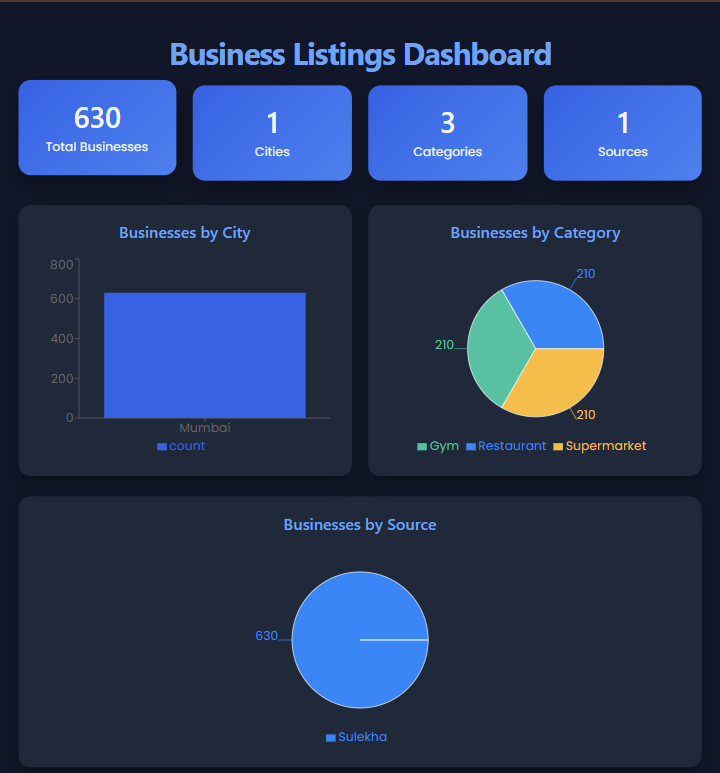
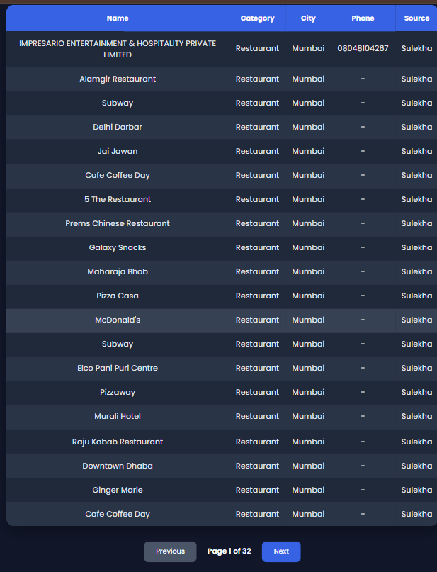
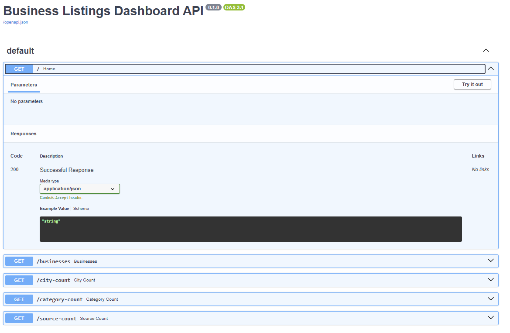

# Business Listings Dashboard

## Overview

This project is a Business Listings Dashboard developed as part of a Data Science Internship Assignment.

The application scrapes business listing data from Sulekha, stores it in a MySQL database, provides REST APIs using FastAPI, and displays the data in a React dashboard with charts and tables.

The project contains around **630 business listings** from different categories like Restaurants, Gyms, and Supermarkets.

---

## Technologies Used

### Frontend
- React.js
- Axios
- Recharts
- CSS

### Backend
- FastAPI
- SQLAlchemy
- Uvicorn

### Database
- MySQL

### Web Scraping
- Python
- Selenium
- ChromeDriver

---

## Features

- Scrape business listings using Selenium
- Store data in MySQL
- Fetch data using FastAPI APIs
- Display dashboard cards
- City-wise business count
- Category-wise business count
- Source-wise business count
- Search businesses
- Filter by category
- Pagination
- Responsive dashboard

---

## Project Structure

```
BusinessListingsDashboard
│
├── backend
├── frontend
├── scraper
├── database
├── data
└── README.md
```

---

## Database Table

Table Name: **listing_master**

Columns:

- id
- business_name
- category
- city
- address
- phone
- source
- created_at

---

## API Endpoints

| Method | Endpoint |
|---------|----------|
| GET | / |
| GET | /businesses |
| GET | /city-count |
| GET | /category-count |
| GET | /source-count |

---

## How to Run the Project

### Backend

```
cd backend

pip install -r requirements.txt

uvicorn main:app --reload
```

Open:

```
http://127.0.0.1:8000/docs
```

---

### Frontend

```
cd frontend

npm install

npm run dev
```

Open:

```
http://localhost:5173
```

---

## Dashboard

The dashboard shows:

- Total Businesses
- Total Categories
- Total Cities
- Total Sources
- City-wise Bar Chart
- Category-wise Pie Chart
- Source-wise Pie Chart
- Business Listings Table

---
## Screenshots

### Dashboard Overview

The dashboard displays summary cards and interactive charts for business analytics.



---

### Business Listings

The business listings table supports search, category filtering, and pagination.



---

### FastAPI Swagger Documentation

The backend APIs are documented and tested using FastAPI Swagger UI.



---

## Challenges Faced

During the development of this project, I encountered a few challenges:

* Loading all business listings from the website required repeatedly clicking the **"View More"** button using Selenium.
* Some business listings did not contain complete information, such as phone numbers or addresses, so missing values had to be handled.
* Mapping the scraped CSV data correctly into the MySQL database required careful validation of column names and data types.
* Connecting the React frontend with the FastAPI backend involved configuring API requests and resolving CORS-related issues.
* Designing a responsive dashboard with charts, search, filters, and pagination while keeping the interface clean and easy to use.

These challenges helped me improve my understanding of web scraping, database integration, REST API development, and frontend-backend communication.


---

## Future Improvements

- Add more cities
- Add more business categories
- Export data to CSV
- Improve dashboard UI
- Add authentication

---

## Author

Akash Lohar

B.Tech Electronics and Communication Engineering